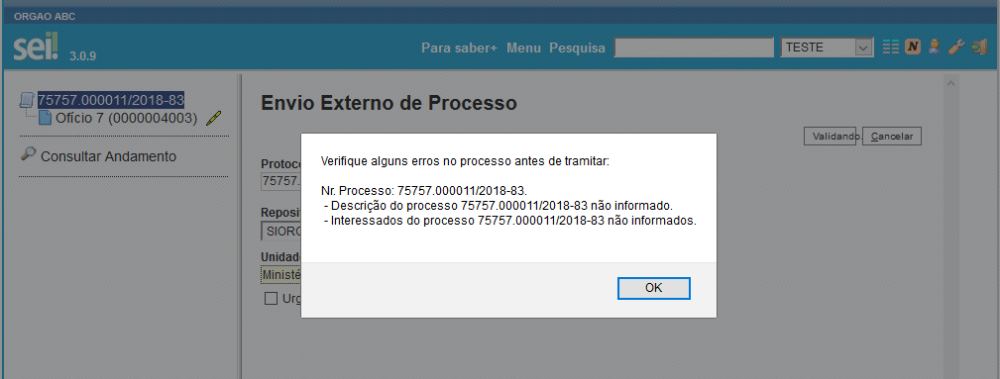
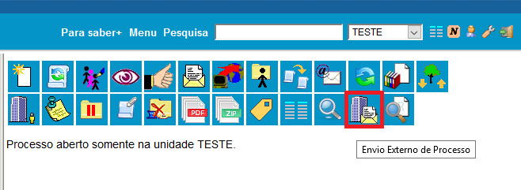
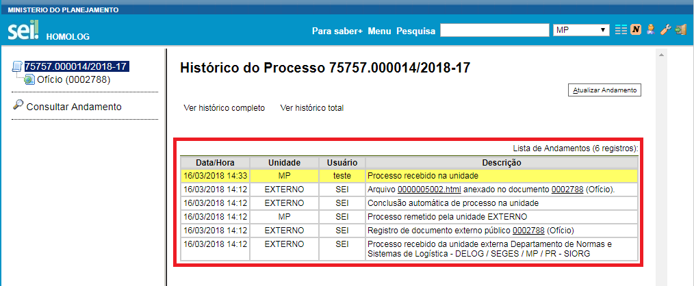

# Manual do Módulo ConectaGov

O módulo **conectagov** PEN é o responsável por integrar o Sistema Eletrônico de Informações - SEI à plataforma de interoperabilidade do Processo Eletrônico Nacional - PEN. 

O projeto ConectaGov PEN tem como objetivo interligar todos os sistema de processo eletrônico do Poder Executivo Federal a fim de simplificar a troca de documentos oficiais entre instituições de forma rápida e segura. 

A utilização deste módulo adicionará novas funcionalidades ao SEI permitindo, entre outros:
 - Enviar processos administrativos para instituições externas
 - Receber processos administrativos de outros órgãos
 - Acompanhar a relação de processos em trâmite externo
 
Para maiores informações sobre o ConectaGov e o PEN, acesse http://www.planejamento.gov.br/pensei.

Este manual está estruturado nas seguintes seções:

 1. **Instalação**
Procedimentos de instalação do módulo nos servidores de aplicação e atualização do banco de dados.

 3. **Configuração**
 Orientações voltadas para o administrador do sistema configurar os parâmetros do módulo para o correto funcionamento da integração.
 
 4. **Utilização**
 Apresentação das funcionalidades que permitem o trâmite externo de processos e o acompanhamento de seu histórico.
 
 5. **Suporte**
 Canais de comunicação para resolver problemas ou tirar dúvidas sobre o módulo e os demais componentes do ConectaGov.

## Instalação

### Pré-requisitos
 - **SEI versão 3.0.5 ou superior instalada, exceto a versão 3.0.10.**
 - Usuário de acesso ao banco de dados do SEI e SIP com  permissões para criar novas estruturas no banco de dados.
  
Para iniciar os procedimentos de configuração do módulo, será necessário registrar no **ConectaGov** as unidades administrativas que poderão realizar o envio e recebimento de processos/documentos externo no SEI. Este procedimento precisa ser realizado pelo **Gestor de Protocolo** previamente habilitado no portal do **ConectaGov**. Os testes devem ser feitos primeiro em um ambiente de desenvolvimento/homologação. 
Para solicitação de acesso aos ambientes, acesse os seguintes endereços:

 - Desenvolvimento [http://pen-portal.trafficmanager.net/solicitarCadastroComite](http://pen-portal.trafficmanager.net/solicitarCadastroComite "DESENVOLVIMENTO: Portal de Administração ConectaGov PEN - Cadastro de Comitê")
 - Homologação [http://homolog.pen.portal.trafficmanager.net/solicitarCadastroComite](http://homolog.pen.portal.trafficmanager.net/solicitarCadastroComite "HOMOLOGAÇÃO: Portal de Administração ConectaGov PEN - Cadastro de Comitê")
 - Produção [http://conectagov.processoeletronico.gov.br/solicitarCadastroComite](http://conectagov.processoeletronico.gov.br/solicitarCadastroComite "PRODUÇÃO: Portal de Administração ConectaGov PEN - Cadastro de Comitê")

 Para maiores informações, entre em contato pelo e-mail processo.eletronico@planejamento.gov.br

### Procedimentos

1. Fazer backup dos banco de dados do SEI e SIP e dos arquivos de configuração do sistema.
 
2. Instalar o **gearmand** e o **supervisord** no servidor responsável por tratar o agendamento de tarefas do sistema.
Estes dois componentes são utilizados para gerenciar a fila de recebimento de novos processos de forma assíncrona pelo SEI.

**Importante:** É imprescindível que os dois sejam instalados **SOMENTE** no nó de aplicação em que está configurado o CRON de agendamento do SEI.

    Exemplo de instalação do German e Supervisor no CentOS:

        # pre-requisito
        yum install epel-release && yum update

        # instalação do gearman e supervisord               
        yum install supervisor gearmand libgearman libgearman-devel php56*-pecl-gearman

3. Configuração dos serviços de recebimento de processos no **supervisor** 

    Neste passo será configurado os dois scripts PHP responsáveis por fazer monitoramento de pendências de trâmite no ConectaGov e processar o recebimento de novos processos.

    As linhas de configuração apresentadas abaixo deverão ser adicionadas no final do arquivo de configuração do *Supervisor* (/etc/supervisord.conf).
    
    **Atenção 1:** No parâmetro *[user]* deve ser configurado o usuário que executa o servidor web (verifique no seu servidor qual é o usuario. Ex.: apache)
    
    **Atenção 2:** Verifique se a localização dos scripts ProcessarPendenciasRN.php e PendenciasTramiteRN.php estão corretas no parâmetro *[command]*.

    Exemplo de configuração do supervisor:

        # adicione no final do arquivo
        [program:sei_processar_pendencias]
        command=/usr/bin/php -c /etc/php.ini /opt/sei/web/modulos/pen/rn/ProcessarPendenciasRN.php
        numprocs=1
        directory=/opt/sei/web
        user=apache
        autostart=true
        edutorestart=true
        startsecs=15
        startretries=3
        log_stdout=true
        log_stderr=true
        logfile=/var/log/supervisor/sei_processar_pendencias.log
        logfile_maxbytes=10MB
        logfile_backups=50

        [program:sei_monitorar_pendencias]
        command=/usr/bin/php -c /etc/php.ini /opt/sei/web/modulos/pen/rn/PendenciasTramiteRN.php
        numprocs=1
        directory=/opt/sei/web
        user=apache
        autostart=true
        autorestart=true
        startsecs=15
        startretries=3
        log_stdout=true
        log_stderr=true
        logfile=/var/log/supervisor/sei_monitorar_pendencias.log
        logfile_maxbytes=10MB
        logfile_backups=50

4. Configurar a tarefa de reinicialização de serviços caso se identifique possíveis indisponibilidades.

    Esta configuração é recomendada como contingência para garantir que os serviços de integração não serão desativados em caso de indisponibilidade momentânea da infraestrutura do ConectaGov.

    Os procedimento descritos abaixo deverão ser executados no mesmo servidor em que está instalado o **supervisor** e o **gearman** (passo 3). 

    Mova o script **verificar-servicos.sh**, localizado na raiz do diretório do módulo, para a pasta de **sei/bin** do SEI. 

        cp [DIRETORIO_RAIZ_INSTALAÇÃO]/sei/web/modulos/pen/verificar-servicos.sh /opt/sei/bin/

    Configure este script no serviço de agendamento CRON com uma periodicidade sugerida de 10 minutos, tempo este utilizado para o devido monitoramento e tentativa de reativação dos serviços.

        # crontab -e 
        */10 * * * * [DIRETORIO_RAIZ_INSTALAÇÃO]/sei/bin/verificar-servicos.sh

5.  Configurar módulo ConectaGov no arquivo de configuração do SEI

    Editar o arquivo **sei/config/ConfiguracaoSEI.php**, tomando o cuidado de usar editor que não altere o charset ISO 5589-1 do arquivo, para adicionar a referência ao módulo PEN na chave **[Modulos]** abaixo da chave **[SEI]**:    

        'SEI' => array(
            'URL' => 'http://[servidor sei]/sei',
            'Producao' => true,
            'RepositorioArquivos' => '/var/sei/arquivos',
            'Modulos' => array('PENIntegracao' => 'pen'),
            ),

    Adicionar a referência ao módulo PEN na array da chave 'Modulos' indicada acima:
            
        'Modulos' => array('PENIntegracao' => 'pen')

6.  Mover o diretório de arquivos do módulo "pen" para o diretório sei/web/modulos/
    Importante renomear a pasta do módulo "mod-sei-pen" para somente "pen" por questões de padronização de nomenclatura.

7. Mover o arquivo do certificado digital utilizado para integração com o **ConectaGov** para o diretório "sei/config/".
    
    Para melhor organização dos arquivos dentro do diretório **sei/config**, sugerimos a criação da uma nova pasta chamada **sei/config/certificados\_mod_conectagov** para adicionar estes arquivos.
    
    Os certificados digitais para conectar aos ambientes de desenvolvimento e homologação do PEN estão localizados no pacote de instalação disponibilizado pela equipe técnica do Ministério do Planejamento, Desenvolvimento e Gestão - MPDG e são disponibilizados no ato do credenciamento da instituição no ConectaGov. 

    Para o ambiente de produção, deverá ser utilizado um certificado digital válido gerado por uma Autoridade de Registro - AR confiável (Exemplo: ICP-Brasil, Certisign, Verisign, etc.).

    Maiores informações e solicitações podem ser feitas através do e-mail processo.eletronico@planejamento.gov.br.

8. Mover o arquivo de instalação do módulo no SEI **sei\_atualizar\_versao\_modulo_pen.php** para a pasta **sei/scripts**. Lembre-se de mover, e não copiar, por questões de segurança e padronização.

9. Mover o arquivo de instalação do módulo no SIP **sip\_atualizar\_versao\_modulo\_pen.php** para a pasta **sip/scripts**. Lembre-se de mover, e não copiar, por questões de segurança e padronização.

10. Executar o script **sip\_atualizar\_versao\_modulo_pen.php** para atualizar o banco de dados do SIP para o funcionamento do módulo:

        # php -c /etc/php.ini [DIRETORIO_RAIZ_INSTALAÇÃO]/sip/scripts/sip_atualizar_versao_modulo_pen.php

11. Executar o script **sei_atualizar_versao_modulo_pen.php** para inserção de dados no banco do SEI referente ao módulo.

        # php -c /etc/php.ini [DIRETORIO_RAIZ_INSTALAÇÃO]/sei/scripts/sei_atualizar_versao_modulo_pen.php

12. Após a instalação do módulo, o usuário de manutenção deverá ser alterado para outro contendo apenas as permissões de leitura e escrita no banco de dados.

13. Configurar as permissões de segurança para os perfis e unidades que poderão realizar o trâmite externo de processos. 

    Por padrão, as funcionalidades (recursos) criados pelo módulo não são atribuídos automaticamente à um perfil específico do sistema, evitando sua disponibilização para todos os usuários do sistema sem a prévia definição dos administradores.

    Sugerimos que seja criado um novo perfil de usuário que receberá as permissões incluídas pelo módulo (pen_*). Este novo perfil deverá ser atribuído aos usuários que poderão realizar o trâmite externo de processos para outras instituições. 

    Para criação do novo perfil e atribuição dos devidos recursos, acesse [**SIP > Perfil > Novo**]

    Exemplo: ***Perfil: Envio Externo***
    
    Recursos:
    
        * pen_procedimento_expedido_listar  
        * pen_procedimento_expedir
    
    Também será necessário a configuração dos seguintes recursos ao perfil ADMINISTRADOR para permitir o mesmo realizar as configurações do módulo:
    
        * pen_map_hipotese_legal_envio_alterar
        * pen_map_hipotese_legal_envio_cadastrar
        * pen_map_hipotese_legal_envio_excluir
        * pen_map_hipotese_legal_envio_listar
        * pen_map_hipotese_legal_padrao
        * pen_map_hipotese_legal_padrao_cadastrar
        * pen_map_hipotese_legal_recebimento_alterar
        * pen_map_hipotese_legal_recebimento_cadastrar
        * pen_map_hipotese_legal_recebimento_excluir
        * pen_map_hipotese_legal_recebimento_listar
        * pen_map_tipo_documento_envio_alterar
        * pen_map_tipo_documento_envio_cadastrar
        * pen_map_tipo_documento_envio_excluir
        * pen_map_tipo_documento_envio_listar
        * pen_map_tipo_documento_envio_visualizar
        * pen_map_tipo_documento_recebimento_alterar
        * pen_map_tipo_documento_recebimento_cadastrar
        * pen_map_tipo_documento_recebimento_excluir
        * pen_map_tipo_documento_recebimento_listar
        * pen_map_tipo_documento_recebimento_visualizar
        * pen_map_unidade_alterar
        * pen_map_unidade_cadastrar   
        * pen_map_unidade_excluir 
        * pen_map_unidade_listar
        * pen_parametros_configuracao
        * pen_parametros_configuracao_alterar  
    
    Recomenda-se que os recursos acima não sejam atribuídos aos perfis básicos do sistema.
    
14. Configurar as unidades do SEI que poderão realizar o envio e recebimento de trâmites externos

    Os ID's de unidades são gerenciados pela própria instituição no portal do Processo Eletrônico Nacional ( http://conectagov.processoeletronico.gov.br). 
    No credenciamento da instituição, estes valores serão passados pela unidade de TI  do MPDG.

    Acesse o menu **[SEI > Administração > Processo Eletrônico Nacional > Mapeamento de Unidades]** e vincule as unidades administrativas com seus respectivos identificadores registrados no portal do Processo Eletrônico Nacional.

15. Configuração de unidade administrativa virtual para gerenciamento de envio e recebimento de processos pelo módulo.

    Esta configuração é necessária para o SEI realizar as devidas regras de registro de históricos de trâmites externos e bloqueio de edição metadados de processos/documentos. Tal unidade será utilizada internamente pelo módulo e não deverá ter acesso liberado para nenhum usuário do sistema.

    15.1. Acessar o SIP e criar uma nova unidade administrativa com as seguintes configurações:
    
        Sigla: EXTERNO
        Nome: Unidade Externa

    15.2. Configurar a nova unidade na hierarquia do SEI, através da funcionalidade **[SIP > Hierarquias > Montar]**

    Sugerimos que está unidade seja configurada no mesmo nível hierárquico da unidade de teste padrão existente no SEI. Para saber qual é a unidade de testes, basta verificar o parâmetro do SEI chamado **SEI_UNIDADE_TESTE**

16. Configuração de tipo de processo a ser aplicado aos processos recebidos de instituições externas.

    Como o processo de recebimento de novos processos será feito de forma automática pelo módulo de integração, o sistema precisa atribuir um Tipo de Processo padrão para o novo procedimento recebido. Importante lembrar que a criação de um novo tipo de processo não é obrigatório, sendo possível utilizar outro pré-existente. 

    Caso a opção for pela criação de um novo tipo de processo específico, segue abaixo sugestão para configuração:

        Nome: Processo Recebido Externamente (a classificar) 
        Descrição: Processos recebidos de outras instituições 
        // O assunto deve ser definido juntamente com a área de documentação
        Sugestão de Assuntos: 019.01 - INFORMAÇÕES SOBRE O ÓRGÃO
        Restringir aos Órgãos: [vazio] 
        Restringir às Unidades: [vazio] 
        Níveis de Acesso Permitidos: Restrito e Público 
        Nível de Acesso Sugerido: Público 
        Processo único no órgão por usuário: Não
        Interessado: Não 
        Interno do Sistema: Sim

17. Configurar os parâmetros do Módulo de Integração Pen
Acesse a funcionalidade **[SEI > Administração > Processo Eletrônico Nacional > Parâmetros de Configuração]** para configurar os parâmetros de funcionamento do módulo:  
    * **Endereço do Web Service:**  
    *Endereço dos serviços de integração do PEN* 
        - Desenvolvimento: https://pen-api.trafficmanager.net/interoperabilidade/soap/v2/
        - Homologação: https://homolog.pen.api.trafficmanager.net/interoperabilidade/soap/v2/
        - Produção: https://api.conectagov.processoeletronico.gov.br/interoperabilidade/soap/v2/  
    * **Endereço do Web Service de Pendências**:  
    *Endereço dos serviços de notificação de trâmites de processos*
        - Desenvolvimento: https://pen-pendencias.trafficmanager.net/
	    - Homologação: https://homolog.pen.pendencias.trafficmanager.net/
	    - Produção: https://pendencias.conectagov.processoeletronico.gov.br/  
    * **ID do Repositório de Estruturas:**   
    *ID do repositório de origem do órgão na estrutura organizacional. Este identificador é enviado para a instituição junto com o pacote de integração.*  
        - *Valor 1 (Código de identificação da estrutura organizacional do Poder Executivo - SIORG)*  
    * **Localização do Certificado Digital:**  
     - *Localização do certificado digital o órgão (arquivo do passo 8)*  
    * **Número Máximo de Tentativas de Recebimento:**  
        - *Valor padrão: 3*  
    * **Tamanho Máximo de Documentos Expedidos:**  
        - *Valor padrão: 50*  
    * **Senha do Certificado Digital:**  
        - *Senha do certificado digital*  
    * **Tipo de Processo Externo:**  
    *Id do tipo de documento externo. *  
        - *Configurar com o ID do Tipo de Processo Externo configurado no passo 15*  
    * **Unidade Geradora de Processo e Documento Recebido:**  
    *Id da unidade de origem que serão atribuídos os documentos recebidos de um outro órgão.*   
        - *Configurar com o ID da Unidade criada no passo 14*

18. Iniciar serviços de monitoramento de pendências de trâmite **Gearman** e **Supervisor**

        # service gearmand start && service supervisord start

    Executar o comando **ps -ef** e verificar se os dois processos seguintes estão em execução: 

        # /usr/bin/php -c /etc/php.ini [DIRETORIO_RAIZ_INSTALAÇÃO]/sei/modulos/pen/rn/PendenciasTramiteRN.php    
        # /usr/bin/php -c /etc/php.ini [DIRETORIO_RAIZ_INSTALAÇÃO]/sei/modulos/pen/rn/ProcessarPendenciasRN.php

    Caso não esteja houve algum problema de configuração e a expedição de processos não irá funcionar. 
**Atenção**: Importante colocar o serviço para ser iniciado automaticamente juntamente com o servidor. 

19. Realizar o mapeamento de tipos de documentos do SEI com as especies documentais definidas no PEN, tanto de envio quanto de recebimento. 

    Esta configuração deve ser feita antes de começar a utilização do módulo.
    - SEI >> Administração >> Processo Eletrônico Nacional >> Mapeamento de Tipos de Documentos >> **Envio** >> Cadastrar
    - SEI >> Administração >> Processo Eletrônico Nacional >> Mapeamento de Tipos de Documentos >> **Recebimento** >> Cadastrar

    **Observação**: Os tipos de documentos a serem mapeados deverão estar configurados no SEI como Externo ou Interno/Externo 

20. Realizar o mapeamento das hipóteses legais do SEI com as definidas no PEN para permitir o trâmite externo de processos e documentos restritos.

    **Atenção**: Antes de iniciar esta configuração, será necessário executar manualmente o agendamento **PENAgendamentoRN::atualizarHipotesesLegais** em [**SEI > Infra > Agendamentos**]. Esta tarefa é necessária para atualizar o SEI com a última versão da tabela de hipóteses legais do PEN.

    Este mapeamento deve ser feito antes de começar a utilização do módulo e está disponível em 
    - SEI >> Administração >> Processo Eletrônico Nacional >> Mapeamento de Hipóteses Legais >> **Envio** >> Cadastrar
    - SEI >> Administração >> Processo Eletrônico Nacional >> Mapeamento de Hipóteses Legais >> **Recebimento** >> Cadastrar

    **Observação**: Os tipos de documentos a serem mapeados deverão estar configurados no SEI como Externo ou Interno/Externo 

21. O protocolo de comunicação implementado pelo PEN realiza a geração e assinatura digital de recibos de entrega e conclusão dos trâmites de processo. Para a correta geração dos recibos pelo módulo, é indispensável que todos os nós da aplicação estejam configurados com o serviço de sincronização de relógios oficial NTP.br.    

    Este link pode ajudar a configurar conforme o SO utilizado: http://ntp.br/guia-linux-comum.php

## Utilização

Esta seção tem por objetivo demonstrar as funcionalidades que são disponibilizadas pelo módulo de trâmite do PEN e também as configurações que devem ser realizadas no próprio SEI para o correto funcionamento.

### Informações Obrigatórias para Envio Externo de Processo

O ConectaGov PEN atende a diferentes sistemas de gestão eletrônica de documentos (GED) e sistemas informatizados de gestão arquivística de documentos (SIGAD). Para permitir a interoperabilidade entre estes tipos de sistemas, definiu-se um padrão de dados para intercâmbio.

O padrão de dados define atributos que são obrigatórios e opcionais. A obrigatoriedade de alguns elementos obriga que determinadas informações sejam incluídas no processo, as quais, no SEI, originalmente, são opcionais.

Ao criar o processo, para envio externo pelo ConectaGov PEN, são obrigatórios os campos **especificação e interessado** (deve haver pelo menos um interessado no processo)

O SEI fará uma verificação das informações pendentes para envio e exibirá uma mensagem para o usuário, conforme imagem:

Verifica-se também se o processo possui pelo menos um documento interno assinado ou se possui algum documento externo, além de impedir o trâmite de processos que possuam documentos sem assinatura, conforme exemplificado a seguir:

### Envio Externo de Processo

Para realizar o trâmite externo do processo, o módulo disponibiliza ao usuário (**caso o seu perfil possua o recurso pen\_procedimento\_expedir**) um ícone na tela de processos, conforme imagem abaixo: 

Ao acionar o ícone de envio externo de processo, disponibiliza-se uma tela onde mostra-se o número do processo selecionado para envio externo, que é apenas informativo, a opção de escolha do repositório de estruturas do receptor (que no caso do Poder Executivo Federal será o do SIORG -  Sistema de Organização e Inovação Institucional do Governo Federal), o nome da unidade receptora na estrutura organizacional e opção de indicar se trata-se de processo com urgência.

O cadastro da estrutura organizacional é feito previamente no Portal de Administração do ConectaGov PEN. A administração central do portal é feita pela equipe do Ministério do Planejamento, Desenvolvimento e Gestão - MP, embora o cadastro da estrutura propriamente dita seja feito por um perfil denominado Comitê Gestor de Protocolo, informado pelo órgão ou entidade e habilitado no portal pela equipe do MP, conforme [fluxo definido](https://www.comprasgovernamentais.gov.br/images/Barramento/FluxoCredenciais.png).
Para maiores informações sobre o Comitê Gestor de Protocolo, consulte o [manual específico](https://www.comprasgovernamentais.gov.br/images/Barramento/ManualdoGestor.pdf). 

O ConectaGov PEN permite a participação de órgãos e entidades de outros poderes e esferas administrativas, sendo no Poder Executivo Federal o uso obrigatório do SIORG, conforme parágrafo único do Art. 25, do [Decreto nº 6.944, de 21 de agosto de 2009](http://www.planalto.gov.br/ccivil_03/_Ato2007-2010/2009/Decreto/D6944.htm).   

Ao selecionar o repositório de estruturas desejado, é necessário digital o nome da unidade administrativa receptora do processo. Dinamicamente, sugere-se o nome da unidade, baseado na configuração feita no Portal de Administração do ConectaGov PEN. **As unidades disponíveis para envio externo dependem da configuração realizada por cada Comitê Gestor de Protocolo dos órgãos e entidades.**

Na tela de envio externo de processo, há a opção de indicar a **urgência** para o processo. As opções são automaticamente sincronizadas a partir do serviço do ConectaGov PEN.

Ao realizar o envio externo, o módulo faz uma **série de validações no processo** para que a informação seja corretamente enviada ao serviço do ConectGov PEN. O andamento do progresso de validação e envio é exibido por meio de uma janela *pop-up* do navegador web. É importante permitir a abertura de *pop-ups* no navegador web, para que a operação possa ser verificada.

Uma vez que o processo tenha sido recebido com sucesso pelo ConectGov PEN, a seguinte mensagem é exibida. **Mas isso não significa que a unidade destinatária recebeu e aceitou o processo, pois esta também deve fazer uma série de validações,** conforme explicado na próxima seção.

### Informações Registradas nos Andamentos do Processo (Histórico)

O ConectaGov PEN atua como uma **terceiro confiável** no trâmite do processo administrativo. Em um primeiro momento, o módulo do SEI faz uma série de validações de informações constantes do processo a ser enviado. Uma vez validadas estas informações, a operação de envio é registrada no andamento do processo. **Mas isso ainda não reflete o sucesso no trâmite de fato**, pois a unidade receptora também faz uma série de validações como, por exemplo, os tamanhos de documentos que tem capacidade de receber, as espécies documentais, hipóteses legais, dentre outras. Uma vez validados, na origem, os requisitos para envio externo,** registra-se no andamento do processo a operação de envio** por meio do ConectaGov, conforme o seguinte exemplo:

Enquanto a unidade receptora não confirma o recebimento, o SEI passa a indicar que aquele processo **encontra-se em envio externo**, aguardando o recebimento. Nesse momento, o processo encontra-se bloqueado para edição, evento que possui um alerta de um círculo vermelho à direita do seu número, na tela de Controle do Processo. No estado bloqueado, as opções disponíveis são **apenas de visualização**, sem permitir operações que alteram informações do processo.

O SEI, ao receber o aviso do ConectaGov PEN de que a unidade receptora validou as informações e recebeu o processo, faz o registro no andamento, indicando o sucesso no trâmite, e o **processo passa a indicar que não possui mais andamentos abertos**.

Abaixo, mensagem registrada no histórico, indicando a confirmação do envio externo:

Ainda é possível reabrir o processo na unidade, quando do envio externo ocorrido com sucesso, para que se consulte as informações do processo, caso assim deseje a unidade de origem. Mesmo nesse caso, **apenas a unidade que recebeu o processo** via ConectGov PEN pode realizar a instrução processual, ou seja, efetuar modificações no processo administrativo.

No caso de recebimento de processos por meio do ConectaGov PEN, o processo aparece na área de trabalho da mesma forma que fosse recebido de um trâmite interno (com fonte em vermelho). É importante frisar que, como regra, os processos serão direcionados às unidades receptoras. Caso não haja unidade receptora para determinada unidade visível no ConectGov PEN, o processo é remetido diretamente à unidade destinatária visível para trâmite. A configuração das unidades visíveis para trâmite e das unidades receptoras ficarão a cargo do Comitê Gestor de cada órgão ou unidade.

A operação de recebimento de processo por meio de envio externo também é registrada na unidade destinatária, conforme nota-se na imagem:

No exemplo acima, a unidade EXTERNO é a unidade cadastrada no passo 15 deste manual. Ou seja, a unidade EXTERNO recebeu o processo do ConectaGov PEN, realizou o download dos documentos a partir do ConectaGov e encaminhou o processo para a devida unidade, de forma automática.

A unidade destinatária pode fazer a instrução processual normalmente, inclusive fazendo a devolução do processo para a unidade originária. Neste caso, o ConectGov PEN consegue reconhecer os documentos que a unidade receptora já possui, realizando, assim, o **trâmite apenas daqueles documentos necessários para a unidade de origem**. 
 
### Consulta de Recibos

O ConectGov PEN disponibiliza recibos a respeito das operações realizadas. Os casos de disponibilização de recibos são o de envio para o ConectaGov PEN, disponibilizado ao remetente, e de conclusão de trâmite (disponibilizado para o remetente e o destinatário, para indicar que o destinatário recebeu com sucesso todos os documentos e processos).

Para consultar os recibos gerados, deve-se acessar o ícone correspondente, na barra de controle de processos, conforme imagem seguinte:

Para o remetente, disponibilizam-se os recibos de envio e de conclusão de trâmite, conforme imagens seguintes.
O recibo de envio indica que o ConectaGov PEN recebeu com sucesso os documentos e processos de forma íntegra.

O recibo de trâmite indica que o ConectaGov PEN conseguiu entregar com sucesso os documentos e processos de forma íntegra ao destinatário.

O destinatário pode realizar a consulta ao recibo de trâmite, acessando o ícone de recibos, conforme imagem seguinte.

### Hipóteses de Recusa de Trâmite

### Consulta de Processos Enviados Externamente

## Suporte

## Problemas Conhecidos

### 1. Problema com validação de certificados HTTPS

Caso o ambiente do ConectaGov PEN utilizado nesta configuração esteja utilizando HTTPS com certificado digital não reconhecido  pela ICP-Brasil, será necessário configurar a cadeia não reconhecida como confiável nos servidores de aplicação do SEI. Com isto, os seguintes comandos precisam ser executados em cada nós de aplicação do SEI, incluindo aquele responsável pelo tratamento das tarefas agendadas.

**Caso o sistema seja Debian ou Ubuntu:**

    # Copie o certificado da cadeia de CA (Autoridade Certificadora) que assinou o certificado # fornecido PEN, para o diretório /usr/local/share/ca-certificates:

        cp <CADEIA-CERTIFICADO-CA> /usr/local/share/ca-certificates

    #Efetue a atualização da lista de certificados confiáveis do sistema operacional

        sudo update-ca-certificates

**Caso o sistema seja CentOS 6:**

    # Instalar o pacote ca-certificates package:
        
        yum install ca-certificates

    # Habilitar o recurso de configuração dinâmica de CA

        update-ca-trust force-enable

    # Copiar o arquivo da CA (Autoridade Certificadora) que assinou o certificado fornecido 
    # no passo 7, para a pasta /etc/pki/ca-trust/source/anchors/: 

        cp <CADEIA-CERTIFICADO-CA> /etc/pki/ca-trust/source/anchors/

    # Usar o comando
        
        update-ca-trust extract

### 2. Trâmites não realizados ou recibos não obtidos

Verificar se os serviços *gearman* e *supervisord* estão em execução, conforme orientado no manual de instalação, itens 3 e 4.

### 3. Erro na inicialização do Gearmand "(Address family not supported by protocol) -> libgearman-server/gearmand.cc:442"

Este problema ocorre quando o servidor não possui suporte ao protocolo IPv6. Por padrão, o Gearman inicia sua comunicação utilizando a porta 4730 e utilizando IPv4 e IPv6. Caso um destes não estejam disponíveis, o serviço não será ativado e um log de erro será gerado com a mensagem "(Address family not supported by protocol) -> libgearman-server/gearmand.cc:442".

Para solucionar o problema, duas ações podem ser feitas:
- habilitar o suporte à IPv6 no servidor de aplicação onde o Gearman foi instalado
- configurar o serviço gearmand para utilizar somente IPv4. Para fazer esta configuração, será necessário editar o arquivo de inicialização do Gearmand, normalmente localizado em /etc/sysconfig/gearmand, e adicionar o seguinte parâmetro de inicialização: OPTIONS="--listen=127.0.0.1"
