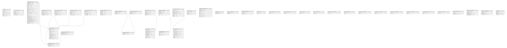

# sei

## Tables

| Name | Columns | Comment | Type |
| ---- | ------- | ------- | ---- |
| [md_pen_bloco](md_pen_bloco.md) | 7 |  | BASE TABLE |
| [md_pen_bloco_protocolo](md_pen_bloco_protocolo.md) | 5 |  | BASE TABLE |
| [md_pen_componente_digital](md_pen_componente_digital.md) | 24 |  | BASE TABLE |
| [md_pen_envio_comp_digitais](md_pen_envio_comp_digitais.md) | 5 |  | BASE TABLE |
| [md_pen_especie_documental](md_pen_especie_documental.md) | 2 |  | BASE TABLE |
| [md_pen_expedir_lote](md_pen_expedir_lote.md) | 10 |  | BASE TABLE |
| [md_pen_hipotese_legal](md_pen_hipotese_legal.md) | 4 |  | BASE TABLE |
| [md_pen_map_tipo_processo](md_pen_map_tipo_processo.md) | 8 |  | BASE TABLE |
| [md_pen_orgao_externo](md_pen_orgao_externo.md) | 10 |  | BASE TABLE |
| [md_pen_parametro](md_pen_parametro.md) | 4 |  | BASE TABLE |
| [md_pen_procedimento_andamento](md_pen_procedimento_andamento.md) | 9 |  | BASE TABLE |
| [md_pen_processo_eletronico](md_pen_processo_eletronico.md) | 3 |  | BASE TABLE |
| [md_pen_protocolo](md_pen_protocolo.md) | 2 |  | BASE TABLE |
| [md_pen_recibo_tramite](md_pen_recibo_tramite.md) | 5 |  | BASE TABLE |
| [md_pen_recibo_tramite_enviado](md_pen_recibo_tramite_enviado.md) | 5 |  | BASE TABLE |
| [md_pen_recibo_tramite_hash](md_pen_recibo_tramite_hash.md) | 5 |  | BASE TABLE |
| [md_pen_recibo_tramite_recebido](md_pen_recibo_tramite_recebido.md) | 5 |  | BASE TABLE |
| [md_pen_rel_doc_map_enviado](md_pen_rel_doc_map_enviado.md) | 3 |  | BASE TABLE |
| [md_pen_rel_doc_map_recebido](md_pen_rel_doc_map_recebido.md) | 3 |  | BASE TABLE |
| [md_pen_rel_expedir_lote](md_pen_rel_expedir_lote.md) | 5 |  | BASE TABLE |
| [md_pen_rel_hipotese_legal](md_pen_rel_hipotese_legal.md) | 5 |  | BASE TABLE |
| [md_pen_rel_processo_apensado](md_pen_rel_processo_apensado.md) | 3 |  | BASE TABLE |
| [md_pen_rel_tarefa_operacao](md_pen_rel_tarefa_operacao.md) | 2 |  | BASE TABLE |
| [md_pen_rel_tipo_doc_map_rec](md_pen_rel_tipo_doc_map_rec.md) | 3 |  | BASE TABLE |
| [md_pen_seq_bloco](md_pen_seq_bloco.md) | 2 |  | BASE TABLE |
| [md_pen_seq_bloco_protocolo](md_pen_seq_bloco_protocolo.md) | 2 |  | BASE TABLE |
| [md_pen_seq_envio_comp_digitais](md_pen_seq_envio_comp_digitais.md) | 2 |  | BASE TABLE |
| [md_pen_seq_expedir_lote](md_pen_seq_expedir_lote.md) | 2 |  | BASE TABLE |
| [md_pen_seq_hipotese_legal](md_pen_seq_hipotese_legal.md) | 2 |  | BASE TABLE |
| [md_pen_seq_map_tp_procedimento](md_pen_seq_map_tp_procedimento.md) | 2 |  | BASE TABLE |
| [md_pen_seq_orgao_externo](md_pen_seq_orgao_externo.md) | 2 |  | BASE TABLE |
| [md_pen_seq_procedimento_andam](md_pen_seq_procedimento_andam.md) | 2 |  | BASE TABLE |
| [md_pen_seq_recibo_tramite_hash](md_pen_seq_recibo_tramite_hash.md) | 2 |  | BASE TABLE |
| [md_pen_seq_rel_doc_map_enviado](md_pen_seq_rel_doc_map_enviado.md) | 2 |  | BASE TABLE |
| [md_pen_seq_rel_doc_map_recebid](md_pen_seq_rel_doc_map_recebid.md) | 2 |  | BASE TABLE |
| [md_pen_seq_rel_hipotese_legal](md_pen_seq_rel_hipotese_legal.md) | 2 |  | BASE TABLE |
| [md_pen_seq_tramite_pendente](md_pen_seq_tramite_pendente.md) | 2 |  | BASE TABLE |
| [md_pen_tramite](md_pen_tramite.md) | 12 |  | BASE TABLE |
| [md_pen_tramite_pendente](md_pen_tramite_pendente.md) | 3 |  | BASE TABLE |
| [md_pen_tramite_processado](md_pen_tramite_processado.md) | 5 |  | BASE TABLE |
| [md_pen_tramite_recibo_envio](md_pen_tramite_recibo_envio.md) | 4 |  | BASE TABLE |
| [md_pen_unidade](md_pen_unidade.md) | 4 |  | BASE TABLE |

## Relations

---

> Generated by [tbls](https://github.com/k1LoW/tbls)
