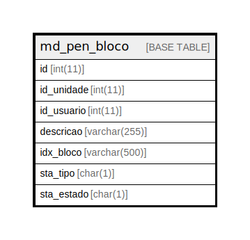

# md_pen_bloco

## Description

<details>
<summary><strong>Table Definition</strong></summary>

```sql
CREATE TABLE `md_pen_bloco` (
  `id` int(11) NOT NULL,
  `id_unidade` int(11) DEFAULT NULL,
  `id_usuario` int(11) DEFAULT NULL,
  `descricao` varchar(255) DEFAULT NULL,
  `idx_bloco` varchar(500) DEFAULT NULL,
  `sta_tipo` char(1) DEFAULT NULL,
  `sta_estado` char(1) DEFAULT NULL,
  PRIMARY KEY (`id`),
  KEY `fk_tramite_bloco_unidade` (`id_unidade`),
  KEY `fk_tramite_bloco_usuario` (`id_usuario`),
  CONSTRAINT `fk_tramite_bloco_unidade` FOREIGN KEY (`id_unidade`) REFERENCES `unidade` (`id_unidade`),
  CONSTRAINT `fk_tramite_bloco_usuario` FOREIGN KEY (`id_usuario`) REFERENCES `usuario` (`id_usuario`)
) ENGINE=InnoDB DEFAULT CHARSET=latin1 COLLATE=latin1_swedish_ci
```

</details>

## Columns

| Name | Type | Default | Nullable | Children | Parents | Comment |
| ---- | ---- | ------- | -------- | -------- | ------- | ------- |
| id | int(11) |  | false |  |  |  |
| id_unidade | int(11) | NULL | true |  |  |  |
| id_usuario | int(11) | NULL | true |  |  |  |
| descricao | varchar(255) | NULL | true |  |  |  |
| idx_bloco | varchar(500) | NULL | true |  |  |  |
| sta_tipo | char(1) | NULL | true |  |  |  |
| sta_estado | char(1) | NULL | true |  |  |  |

## Constraints

| Name | Type | Definition |
| ---- | ---- | ---------- |
| fk_tramite_bloco_unidade | FOREIGN KEY | FOREIGN KEY (id_unidade) REFERENCES unidade (id_unidade) |
| fk_tramite_bloco_usuario | FOREIGN KEY | FOREIGN KEY (id_usuario) REFERENCES usuario (id_usuario) |
| PRIMARY | PRIMARY KEY | PRIMARY KEY (id) |

## Indexes

| Name | Definition |
| ---- | ---------- |
| fk_tramite_bloco_unidade | KEY fk_tramite_bloco_unidade (id_unidade) USING BTREE |
| fk_tramite_bloco_usuario | KEY fk_tramite_bloco_usuario (id_usuario) USING BTREE |
| PRIMARY | PRIMARY KEY (id) USING BTREE |

## Relations



---

> Generated by [tbls](https://github.com/k1LoW/tbls)
