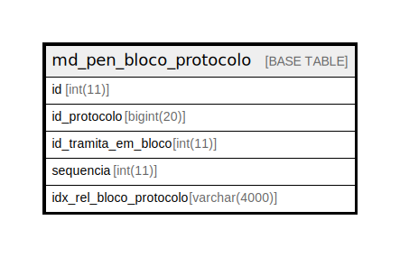

# md_pen_bloco_protocolo

## Description

<details>
<summary><strong>Table Definition</strong></summary>

```sql
CREATE TABLE `md_pen_bloco_protocolo` (
  `id` int(11) NOT NULL,
  `id_protocolo` bigint(20) NOT NULL,
  `id_tramita_em_bloco` int(11) NOT NULL,
  `sequencia` int(11) DEFAULT NULL,
  `idx_rel_bloco_protocolo` varchar(4000) DEFAULT NULL,
  PRIMARY KEY (`id`),
  UNIQUE KEY `UK_md_pen_bloco_protocolo` (`id_protocolo`,`id_tramita_em_bloco`,`sequencia`),
  CONSTRAINT `fk_bloco_protocolo` FOREIGN KEY (`id_protocolo`) REFERENCES `protocolo` (`id_protocolo`)
) ENGINE=InnoDB DEFAULT CHARSET=latin1 COLLATE=latin1_swedish_ci
```

</details>

## Columns

| Name | Type | Default | Nullable | Children | Parents | Comment |
| ---- | ---- | ------- | -------- | -------- | ------- | ------- |
| id | int(11) |  | false |  |  |  |
| id_protocolo | bigint(20) |  | false |  |  |  |
| id_tramita_em_bloco | int(11) |  | false |  |  |  |
| sequencia | int(11) | NULL | true |  |  |  |
| idx_rel_bloco_protocolo | varchar(4000) | NULL | true |  |  |  |

## Constraints

| Name | Type | Definition |
| ---- | ---- | ---------- |
| fk_bloco_protocolo | FOREIGN KEY | FOREIGN KEY (id_protocolo) REFERENCES protocolo (id_protocolo) |
| PRIMARY | PRIMARY KEY | PRIMARY KEY (id) |
| UK_md_pen_bloco_protocolo | UNIQUE | UNIQUE KEY UK_md_pen_bloco_protocolo (id_protocolo, id_tramita_em_bloco, sequencia) |

## Indexes

| Name | Definition |
| ---- | ---------- |
| PRIMARY | PRIMARY KEY (id) USING BTREE |
| UK_md_pen_bloco_protocolo | UNIQUE KEY UK_md_pen_bloco_protocolo (id_protocolo, id_tramita_em_bloco, sequencia) USING BTREE |

## Relations



---

> Generated by [tbls](https://github.com/k1LoW/tbls)
