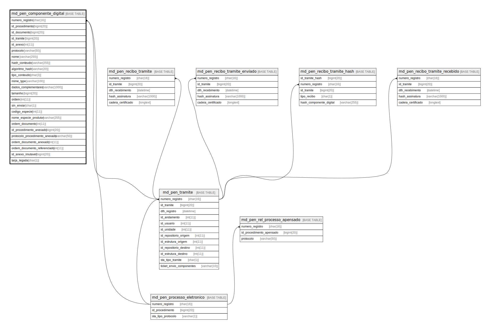

# md_pen_componente_digital

## Description

<details>
<summary><strong>Table Definition</strong></summary>

```sql
CREATE TABLE `md_pen_componente_digital` (
  `numero_registro` char(16) NOT NULL,
  `id_procedimento` bigint(20) NOT NULL,
  `id_documento` bigint(20) NOT NULL,
  `id_tramite` bigint(20) NOT NULL,
  `id_anexo` int(11) DEFAULT NULL,
  `protocolo` varchar(50) NOT NULL,
  `nome` varchar(255) NOT NULL,
  `hash_conteudo` varchar(255) NOT NULL,
  `algoritmo_hash` varchar(20) NOT NULL,
  `tipo_conteudo` char(3) NOT NULL,
  `mime_type` varchar(100) NOT NULL,
  `dados_complementares` varchar(1000) DEFAULT NULL,
  `tamanho` bigint(20) NOT NULL,
  `ordem` int(11) NOT NULL,
  `sin_enviar` char(1) NOT NULL DEFAULT 'N',
  `codigo_especie` int(11) DEFAULT NULL,
  `nome_especie_produtor` varchar(255) DEFAULT NULL,
  `ordem_documento` int(11) NOT NULL,
  `id_procedimento_anexado` bigint(20) DEFAULT NULL,
  `protocolo_procedimento_anexado` varchar(50) DEFAULT NULL,
  `ordem_documento_anexado` int(11) DEFAULT NULL,
  `ordem_documento_referenciado` int(11) DEFAULT NULL,
  `id_anexo_imutavel` bigint(20) DEFAULT NULL,
  `tarja_legada` char(1) DEFAULT NULL,
  PRIMARY KEY (`numero_registro`,`id_procedimento`,`id_documento`,`id_tramite`,`ordem_documento`,`ordem`),
  KEY `i01_md_pen_componente_digital` (`numero_registro`),
  KEY `i02_md_pen_componente_digital` (`id_procedimento`),
  KEY `i03_md_pen_componente_digital` (`id_documento`),
  KEY `i04_md_pen_componente_digital` (`id_tramite`),
  KEY `fk_md_pen_comp_dig_anexo` (`id_anexo`),
  KEY `fk_md_pen_comp_dig_tramite` (`numero_registro`,`id_tramite`),
  CONSTRAINT `fk_md_pen_comp_dig_anexo` FOREIGN KEY (`id_anexo`) REFERENCES `anexo` (`id_anexo`),
  CONSTRAINT `fk_md_pen_comp_dig_documento` FOREIGN KEY (`id_documento`) REFERENCES `documento` (`id_documento`),
  CONSTRAINT `fk_md_pen_comp_dig_proc_eletr` FOREIGN KEY (`numero_registro`) REFERENCES `md_pen_processo_eletronico` (`numero_registro`),
  CONSTRAINT `fk_md_pen_comp_dig_procediment` FOREIGN KEY (`id_procedimento`) REFERENCES `procedimento` (`id_procedimento`),
  CONSTRAINT `fk_md_pen_comp_dig_tramite` FOREIGN KEY (`numero_registro`, `id_tramite`) REFERENCES `md_pen_tramite` (`numero_registro`, `id_tramite`)
) ENGINE=InnoDB DEFAULT CHARSET=latin1 COLLATE=latin1_swedish_ci
```

</details>

## Columns

| Name | Type | Default | Nullable | Children | Parents | Comment |
| ---- | ---- | ------- | -------- | -------- | ------- | ------- |
| numero_registro | char(16) |  | false |  | [md_pen_processo_eletronico](md_pen_processo_eletronico.md) [md_pen_tramite](md_pen_tramite.md) |  |
| id_procedimento | bigint(20) |  | false |  |  |  |
| id_documento | bigint(20) |  | false |  |  |  |
| id_tramite | bigint(20) |  | false |  | [md_pen_tramite](md_pen_tramite.md) |  |
| id_anexo | int(11) | NULL | true |  |  |  |
| protocolo | varchar(50) |  | false |  |  |  |
| nome | varchar(255) |  | false |  |  |  |
| hash_conteudo | varchar(255) |  | false |  |  |  |
| algoritmo_hash | varchar(20) |  | false |  |  |  |
| tipo_conteudo | char(3) |  | false |  |  |  |
| mime_type | varchar(100) |  | false |  |  |  |
| dados_complementares | varchar(1000) | NULL | true |  |  |  |
| tamanho | bigint(20) |  | false |  |  |  |
| ordem | int(11) |  | false |  |  |  |
| sin_enviar | char(1) | 'N' | false |  |  |  |
| codigo_especie | int(11) | NULL | true |  |  |  |
| nome_especie_produtor | varchar(255) | NULL | true |  |  |  |
| ordem_documento | int(11) |  | false |  |  |  |
| id_procedimento_anexado | bigint(20) | NULL | true |  |  |  |
| protocolo_procedimento_anexado | varchar(50) | NULL | true |  |  |  |
| ordem_documento_anexado | int(11) | NULL | true |  |  |  |
| ordem_documento_referenciado | int(11) | NULL | true |  |  |  |
| id_anexo_imutavel | bigint(20) | NULL | true |  |  |  |
| tarja_legada | char(1) | NULL | true |  |  |  |

## Constraints

| Name | Type | Definition |
| ---- | ---- | ---------- |
| fk_md_pen_comp_dig_anexo | FOREIGN KEY | FOREIGN KEY (id_anexo) REFERENCES anexo (id_anexo) |
| fk_md_pen_comp_dig_documento | FOREIGN KEY | FOREIGN KEY (id_documento) REFERENCES documento (id_documento) |
| fk_md_pen_comp_dig_procediment | FOREIGN KEY | FOREIGN KEY (id_procedimento) REFERENCES procedimento (id_procedimento) |
| fk_md_pen_comp_dig_proc_eletr | FOREIGN KEY | FOREIGN KEY (numero_registro) REFERENCES md_pen_processo_eletronico (numero_registro) |
| fk_md_pen_comp_dig_tramite | FOREIGN KEY | FOREIGN KEY (numero_registro, id_tramite) REFERENCES md_pen_tramite (numero_registro, id_tramite) |
| PRIMARY | PRIMARY KEY | PRIMARY KEY (numero_registro, id_procedimento, id_documento, id_tramite, ordem_documento, ordem) |

## Indexes

| Name | Definition |
| ---- | ---------- |
| fk_md_pen_comp_dig_anexo | KEY fk_md_pen_comp_dig_anexo (id_anexo) USING BTREE |
| fk_md_pen_comp_dig_tramite | KEY fk_md_pen_comp_dig_tramite (numero_registro, id_tramite) USING BTREE |
| i01_md_pen_componente_digital | KEY i01_md_pen_componente_digital (numero_registro) USING BTREE |
| i02_md_pen_componente_digital | KEY i02_md_pen_componente_digital (id_procedimento) USING BTREE |
| i03_md_pen_componente_digital | KEY i03_md_pen_componente_digital (id_documento) USING BTREE |
| i04_md_pen_componente_digital | KEY i04_md_pen_componente_digital (id_tramite) USING BTREE |
| PRIMARY | PRIMARY KEY (numero_registro, id_procedimento, id_documento, id_tramite, ordem_documento, ordem) USING BTREE |

## Relations



---

> Generated by [tbls](https://github.com/k1LoW/tbls)
