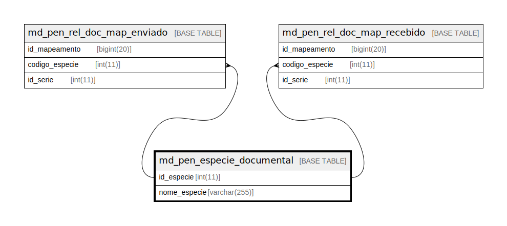

# md_pen_especie_documental

## Description

<details>
<summary><strong>Table Definition</strong></summary>

```sql
CREATE TABLE `md_pen_especie_documental` (
  `id_especie` int(11) NOT NULL,
  `nome_especie` varchar(255) NOT NULL,
  PRIMARY KEY (`id_especie`)
) ENGINE=InnoDB DEFAULT CHARSET=latin1 COLLATE=latin1_swedish_ci
```

</details>

## Columns

| Name | Type | Default | Nullable | Children | Parents | Comment |
| ---- | ---- | ------- | -------- | -------- | ------- | ------- |
| id_especie | int(11) |  | false | [md_pen_rel_doc_map_enviado](md_pen_rel_doc_map_enviado.md) [md_pen_rel_doc_map_recebido](md_pen_rel_doc_map_recebido.md) |  |  |
| nome_especie | varchar(255) |  | false |  |  |  |

## Constraints

| Name | Type | Definition |
| ---- | ---- | ---------- |
| PRIMARY | PRIMARY KEY | PRIMARY KEY (id_especie) |

## Indexes

| Name | Definition |
| ---- | ---------- |
| PRIMARY | PRIMARY KEY (id_especie) USING BTREE |

## Relations



---

> Generated by [tbls](https://github.com/k1LoW/tbls)
