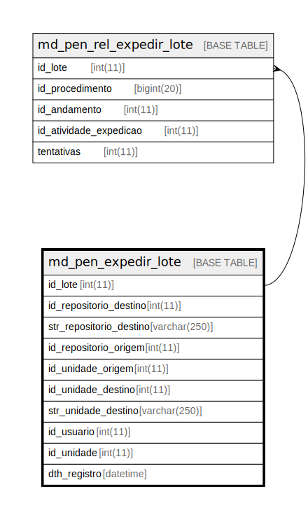

# md_pen_expedir_lote

## Description

<details>
<summary><strong>Table Definition</strong></summary>

```sql
CREATE TABLE `md_pen_expedir_lote` (
  `id_lote` int(11) NOT NULL,
  `id_repositorio_destino` int(11) NOT NULL,
  `str_repositorio_destino` varchar(250) NOT NULL,
  `id_repositorio_origem` int(11) NOT NULL,
  `id_unidade_origem` int(11) NOT NULL,
  `id_unidade_destino` int(11) NOT NULL,
  `str_unidade_destino` varchar(250) NOT NULL,
  `id_usuario` int(11) NOT NULL,
  `id_unidade` int(11) NOT NULL,
  `dth_registro` datetime NOT NULL,
  PRIMARY KEY (`id_lote`),
  KEY `fk_md_pen_expedir_lote_usuario` (`id_usuario`),
  KEY `fk_md_pen_expedir_lote_unidade` (`id_unidade`),
  CONSTRAINT `fk_md_pen_expedir_lote_unidade` FOREIGN KEY (`id_unidade`) REFERENCES `unidade` (`id_unidade`),
  CONSTRAINT `fk_md_pen_expedir_lote_usuario` FOREIGN KEY (`id_usuario`) REFERENCES `usuario` (`id_usuario`)
) ENGINE=InnoDB DEFAULT CHARSET=latin1 COLLATE=latin1_swedish_ci
```

</details>

## Columns

| Name | Type | Default | Nullable | Children | Parents | Comment |
| ---- | ---- | ------- | -------- | -------- | ------- | ------- |
| id_lote | int(11) |  | false | [md_pen_rel_expedir_lote](md_pen_rel_expedir_lote.md) |  |  |
| id_repositorio_destino | int(11) |  | false |  |  |  |
| str_repositorio_destino | varchar(250) |  | false |  |  |  |
| id_repositorio_origem | int(11) |  | false |  |  |  |
| id_unidade_origem | int(11) |  | false |  |  |  |
| id_unidade_destino | int(11) |  | false |  |  |  |
| str_unidade_destino | varchar(250) |  | false |  |  |  |
| id_usuario | int(11) |  | false |  |  |  |
| id_unidade | int(11) |  | false |  |  |  |
| dth_registro | datetime |  | false |  |  |  |

## Constraints

| Name | Type | Definition |
| ---- | ---- | ---------- |
| fk_md_pen_expedir_lote_unidade | FOREIGN KEY | FOREIGN KEY (id_unidade) REFERENCES unidade (id_unidade) |
| fk_md_pen_expedir_lote_usuario | FOREIGN KEY | FOREIGN KEY (id_usuario) REFERENCES usuario (id_usuario) |
| PRIMARY | PRIMARY KEY | PRIMARY KEY (id_lote) |

## Indexes

| Name | Definition |
| ---- | ---------- |
| fk_md_pen_expedir_lote_unidade | KEY fk_md_pen_expedir_lote_unidade (id_unidade) USING BTREE |
| fk_md_pen_expedir_lote_usuario | KEY fk_md_pen_expedir_lote_usuario (id_usuario) USING BTREE |
| PRIMARY | PRIMARY KEY (id_lote) USING BTREE |

## Relations



---

> Generated by [tbls](https://github.com/k1LoW/tbls)
