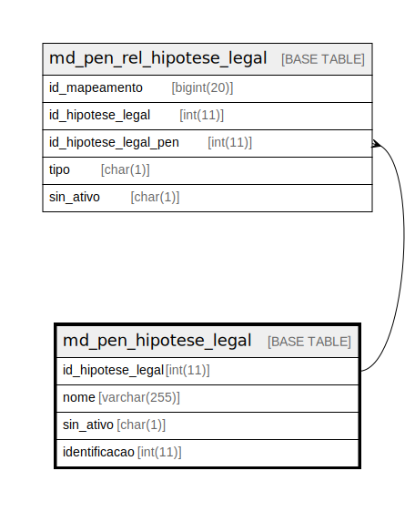

# md_pen_hipotese_legal

## Description

<details>
<summary><strong>Table Definition</strong></summary>

```sql
CREATE TABLE `md_pen_hipotese_legal` (
  `id_hipotese_legal` int(11) NOT NULL,
  `nome` varchar(255) NOT NULL,
  `sin_ativo` char(1) NOT NULL DEFAULT 'S',
  `identificacao` int(11) DEFAULT NULL,
  PRIMARY KEY (`id_hipotese_legal`)
) ENGINE=InnoDB DEFAULT CHARSET=latin1 COLLATE=latin1_swedish_ci
```

</details>

## Columns

| Name | Type | Default | Nullable | Children | Parents | Comment |
| ---- | ---- | ------- | -------- | -------- | ------- | ------- |
| id_hipotese_legal | int(11) |  | false | [md_pen_rel_hipotese_legal](md_pen_rel_hipotese_legal.md) |  |  |
| nome | varchar(255) |  | false |  |  |  |
| sin_ativo | char(1) | 'S' | false |  |  |  |
| identificacao | int(11) | NULL | true |  |  |  |

## Constraints

| Name | Type | Definition |
| ---- | ---- | ---------- |
| PRIMARY | PRIMARY KEY | PRIMARY KEY (id_hipotese_legal) |

## Indexes

| Name | Definition |
| ---- | ---------- |
| PRIMARY | PRIMARY KEY (id_hipotese_legal) USING BTREE |

## Relations



---

> Generated by [tbls](https://github.com/k1LoW/tbls)
