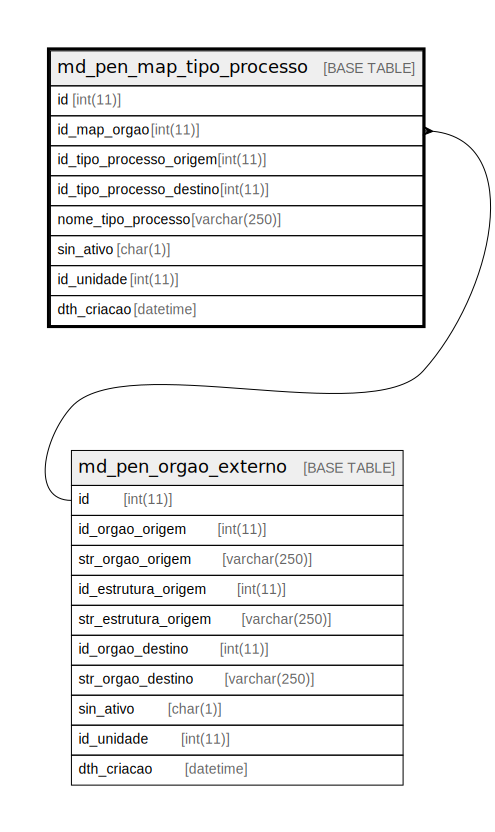

# md_pen_map_tipo_processo

## Description

<details>
<summary><strong>Table Definition</strong></summary>

```sql
CREATE TABLE `md_pen_map_tipo_processo` (
  `id` int(11) NOT NULL,
  `id_map_orgao` int(11) NOT NULL,
  `id_tipo_processo_origem` int(11) NOT NULL,
  `id_tipo_processo_destino` int(11) DEFAULT NULL,
  `nome_tipo_processo` varchar(250) DEFAULT NULL,
  `sin_ativo` char(1) NOT NULL DEFAULT 'S',
  `id_unidade` int(11) NOT NULL,
  `dth_criacao` datetime NOT NULL,
  PRIMARY KEY (`id`),
  KEY `fk_md_pen_map_tipo_processo` (`id_unidade`),
  KEY `fk_md_pen_mapeamento_orgao` (`id_map_orgao`),
  CONSTRAINT `fk_md_pen_map_tipo_processo` FOREIGN KEY (`id_unidade`) REFERENCES `unidade` (`id_unidade`),
  CONSTRAINT `fk_md_pen_mapeamento_orgao` FOREIGN KEY (`id_map_orgao`) REFERENCES `md_pen_orgao_externo` (`id`)
) ENGINE=InnoDB DEFAULT CHARSET=latin1 COLLATE=latin1_swedish_ci
```

</details>

## Columns

| Name | Type | Default | Nullable | Children | Parents | Comment |
| ---- | ---- | ------- | -------- | -------- | ------- | ------- |
| id | int(11) |  | false |  |  |  |
| id_map_orgao | int(11) |  | false |  | [md_pen_orgao_externo](md_pen_orgao_externo.md) |  |
| id_tipo_processo_origem | int(11) |  | false |  |  |  |
| id_tipo_processo_destino | int(11) | NULL | true |  |  |  |
| nome_tipo_processo | varchar(250) | NULL | true |  |  |  |
| sin_ativo | char(1) | 'S' | false |  |  |  |
| id_unidade | int(11) |  | false |  |  |  |
| dth_criacao | datetime |  | false |  |  |  |

## Constraints

| Name | Type | Definition |
| ---- | ---- | ---------- |
| fk_md_pen_mapeamento_orgao | FOREIGN KEY | FOREIGN KEY (id_map_orgao) REFERENCES md_pen_orgao_externo (id) |
| fk_md_pen_map_tipo_processo | FOREIGN KEY | FOREIGN KEY (id_unidade) REFERENCES unidade (id_unidade) |
| PRIMARY | PRIMARY KEY | PRIMARY KEY (id) |

## Indexes

| Name | Definition |
| ---- | ---------- |
| fk_md_pen_mapeamento_orgao | KEY fk_md_pen_mapeamento_orgao (id_map_orgao) USING BTREE |
| fk_md_pen_map_tipo_processo | KEY fk_md_pen_map_tipo_processo (id_unidade) USING BTREE |
| PRIMARY | PRIMARY KEY (id) USING BTREE |

## Relations



---

> Generated by [tbls](https://github.com/k1LoW/tbls)
