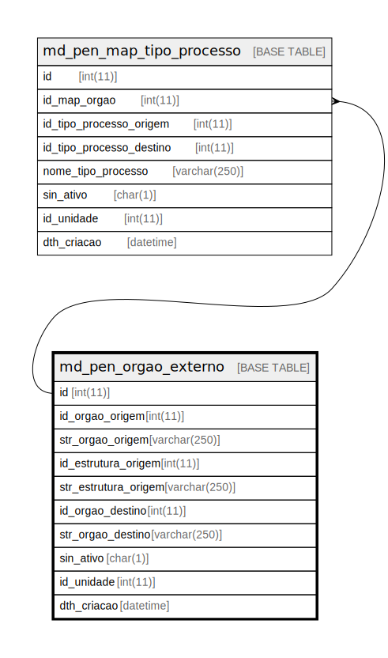

# md_pen_orgao_externo

## Description

<details>
<summary><strong>Table Definition</strong></summary>

```sql
CREATE TABLE `md_pen_orgao_externo` (
  `id` int(11) NOT NULL,
  `id_orgao_origem` int(11) NOT NULL,
  `str_orgao_origem` varchar(250) NOT NULL,
  `id_estrutura_origem` int(11) NOT NULL,
  `str_estrutura_origem` varchar(250) NOT NULL,
  `id_orgao_destino` int(11) NOT NULL,
  `str_orgao_destino` varchar(250) NOT NULL,
  `sin_ativo` char(1) NOT NULL DEFAULT 'S',
  `id_unidade` int(11) NOT NULL,
  `dth_criacao` datetime NOT NULL,
  PRIMARY KEY (`id`),
  KEY `fk_md_pen_orgao_externo` (`id_unidade`),
  CONSTRAINT `fk_md_pen_orgao_externo` FOREIGN KEY (`id_unidade`) REFERENCES `unidade` (`id_unidade`)
) ENGINE=InnoDB DEFAULT CHARSET=latin1 COLLATE=latin1_swedish_ci
```

</details>

## Columns

| Name | Type | Default | Nullable | Children | Parents | Comment |
| ---- | ---- | ------- | -------- | -------- | ------- | ------- |
| id | int(11) |  | false | [md_pen_map_tipo_processo](md_pen_map_tipo_processo.md) |  |  |
| id_orgao_origem | int(11) |  | false |  |  |  |
| str_orgao_origem | varchar(250) |  | false |  |  |  |
| id_estrutura_origem | int(11) |  | false |  |  |  |
| str_estrutura_origem | varchar(250) |  | false |  |  |  |
| id_orgao_destino | int(11) |  | false |  |  |  |
| str_orgao_destino | varchar(250) |  | false |  |  |  |
| sin_ativo | char(1) | 'S' | false |  |  |  |
| id_unidade | int(11) |  | false |  |  |  |
| dth_criacao | datetime |  | false |  |  |  |

## Constraints

| Name | Type | Definition |
| ---- | ---- | ---------- |
| fk_md_pen_orgao_externo | FOREIGN KEY | FOREIGN KEY (id_unidade) REFERENCES unidade (id_unidade) |
| PRIMARY | PRIMARY KEY | PRIMARY KEY (id) |

## Indexes

| Name | Definition |
| ---- | ---------- |
| fk_md_pen_orgao_externo | KEY fk_md_pen_orgao_externo (id_unidade) USING BTREE |
| PRIMARY | PRIMARY KEY (id) USING BTREE |

## Relations



---

> Generated by [tbls](https://github.com/k1LoW/tbls)
