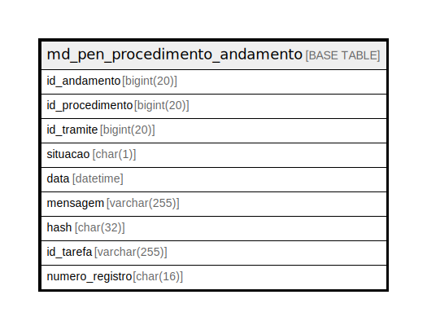

# md_pen_procedimento_andamento

## Description

<details>
<summary><strong>Table Definition</strong></summary>

```sql
CREATE TABLE `md_pen_procedimento_andamento` (
  `id_andamento` bigint(20) NOT NULL,
  `id_procedimento` bigint(20) DEFAULT NULL,
  `id_tramite` bigint(20) NOT NULL,
  `situacao` char(1) NOT NULL DEFAULT 'N',
  `data` datetime NOT NULL,
  `mensagem` varchar(255) NOT NULL,
  `hash` char(32) NOT NULL,
  `id_tarefa` varchar(255) NOT NULL,
  `numero_registro` char(16) DEFAULT NULL,
  PRIMARY KEY (`id_andamento`)
) ENGINE=InnoDB DEFAULT CHARSET=latin1 COLLATE=latin1_swedish_ci
```

</details>

## Columns

| Name | Type | Default | Nullable | Children | Parents | Comment |
| ---- | ---- | ------- | -------- | -------- | ------- | ------- |
| id_andamento | bigint(20) |  | false |  |  |  |
| id_procedimento | bigint(20) | NULL | true |  |  |  |
| id_tramite | bigint(20) |  | false |  |  |  |
| situacao | char(1) | 'N' | false |  |  |  |
| data | datetime |  | false |  |  |  |
| mensagem | varchar(255) |  | false |  |  |  |
| hash | char(32) |  | false |  |  |  |
| id_tarefa | varchar(255) |  | false |  |  |  |
| numero_registro | char(16) | NULL | true |  |  |  |

## Constraints

| Name | Type | Definition |
| ---- | ---- | ---------- |
| PRIMARY | PRIMARY KEY | PRIMARY KEY (id_andamento) |

## Indexes

| Name | Definition |
| ---- | ---------- |
| PRIMARY | PRIMARY KEY (id_andamento) USING BTREE |

## Relations



---

> Generated by [tbls](https://github.com/k1LoW/tbls)
