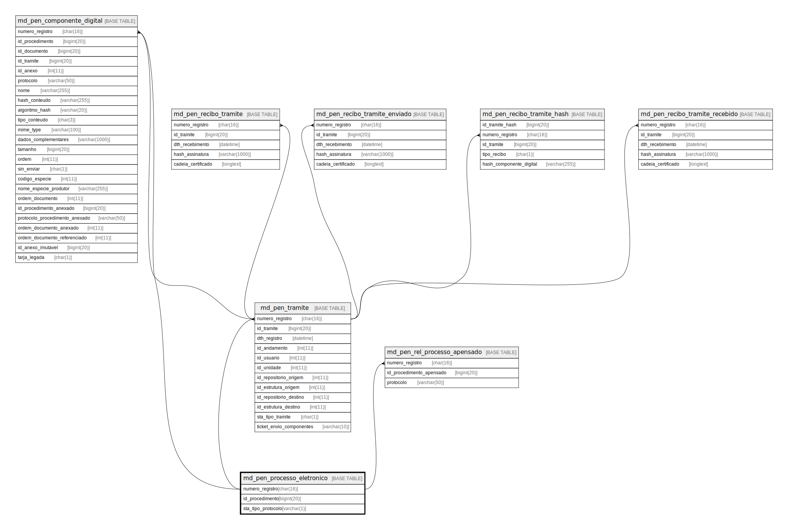

# md_pen_processo_eletronico

## Description

<details>
<summary><strong>Table Definition</strong></summary>

```sql
CREATE TABLE `md_pen_processo_eletronico` (
  `numero_registro` char(16) NOT NULL,
  `id_procedimento` bigint(20) NOT NULL,
  `sta_tipo_protocolo` varchar(1) NOT NULL DEFAULT 'P',
  PRIMARY KEY (`numero_registro`),
  UNIQUE KEY `UK_md_pen_processo_eletronico` (`numero_registro`,`id_procedimento`),
  KEY `fk_md_pen_proc_eletr_procedim` (`id_procedimento`),
  CONSTRAINT `fk_md_pen_proc_eletr_procedim` FOREIGN KEY (`id_procedimento`) REFERENCES `procedimento` (`id_procedimento`)
) ENGINE=InnoDB DEFAULT CHARSET=latin1 COLLATE=latin1_swedish_ci
```

</details>

## Columns

| Name | Type | Default | Nullable | Children | Parents | Comment |
| ---- | ---- | ------- | -------- | -------- | ------- | ------- |
| numero_registro | char(16) |  | false | [md_pen_componente_digital](md_pen_componente_digital.md) [md_pen_rel_processo_apensado](md_pen_rel_processo_apensado.md) [md_pen_tramite](md_pen_tramite.md) |  |  |
| id_procedimento | bigint(20) |  | false |  |  |  |
| sta_tipo_protocolo | varchar(1) | 'P' | false |  |  |  |

## Constraints

| Name | Type | Definition |
| ---- | ---- | ---------- |
| fk_md_pen_proc_eletr_procedim | FOREIGN KEY | FOREIGN KEY (id_procedimento) REFERENCES procedimento (id_procedimento) |
| PRIMARY | PRIMARY KEY | PRIMARY KEY (numero_registro) |
| UK_md_pen_processo_eletronico | UNIQUE | UNIQUE KEY UK_md_pen_processo_eletronico (numero_registro, id_procedimento) |

## Indexes

| Name | Definition |
| ---- | ---------- |
| fk_md_pen_proc_eletr_procedim | KEY fk_md_pen_proc_eletr_procedim (id_procedimento) USING BTREE |
| PRIMARY | PRIMARY KEY (numero_registro) USING BTREE |
| UK_md_pen_processo_eletronico | UNIQUE KEY UK_md_pen_processo_eletronico (numero_registro, id_procedimento) USING BTREE |

## Relations



---

> Generated by [tbls](https://github.com/k1LoW/tbls)
