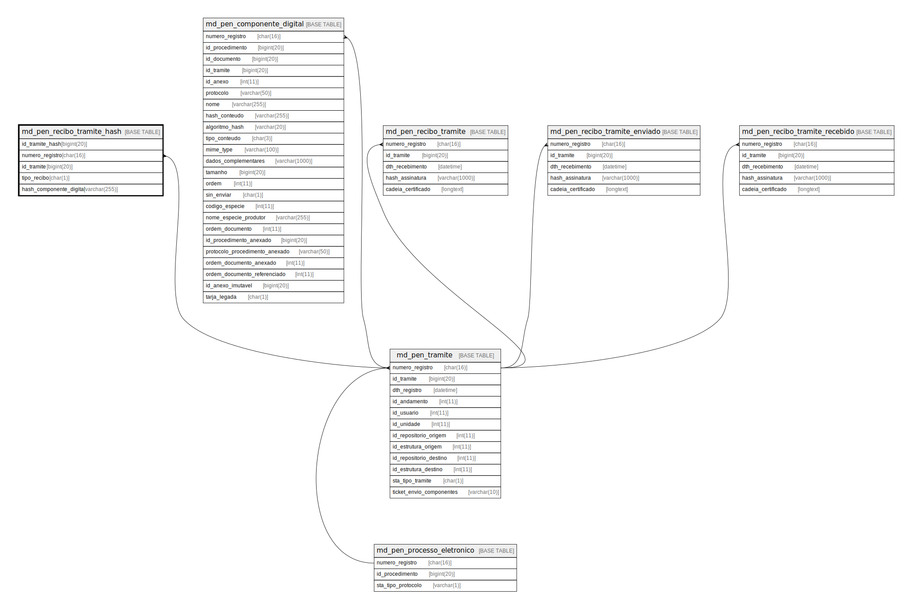

# md_pen_recibo_tramite_hash

## Description

<details>
<summary><strong>Table Definition</strong></summary>

```sql
CREATE TABLE `md_pen_recibo_tramite_hash` (
  `id_tramite_hash` bigint(20) NOT NULL,
  `numero_registro` char(16) NOT NULL,
  `id_tramite` bigint(20) NOT NULL,
  `tipo_recibo` char(1) NOT NULL,
  `hash_componente_digital` varchar(255) NOT NULL,
  PRIMARY KEY (`id_tramite_hash`),
  KEY `fk_md_pen_rec_tram_hash_tram` (`numero_registro`,`id_tramite`),
  CONSTRAINT `fk_md_pen_rec_tram_hash_tram` FOREIGN KEY (`numero_registro`, `id_tramite`) REFERENCES `md_pen_tramite` (`numero_registro`, `id_tramite`)
) ENGINE=InnoDB DEFAULT CHARSET=latin1 COLLATE=latin1_swedish_ci
```

</details>

## Columns

| Name | Type | Default | Nullable | Children | Parents | Comment |
| ---- | ---- | ------- | -------- | -------- | ------- | ------- |
| id_tramite_hash | bigint(20) |  | false |  |  |  |
| numero_registro | char(16) |  | false |  | [md_pen_tramite](md_pen_tramite.md) |  |
| id_tramite | bigint(20) |  | false |  | [md_pen_tramite](md_pen_tramite.md) |  |
| tipo_recibo | char(1) |  | false |  |  |  |
| hash_componente_digital | varchar(255) |  | false |  |  |  |

## Constraints

| Name | Type | Definition |
| ---- | ---- | ---------- |
| fk_md_pen_rec_tram_hash_tram | FOREIGN KEY | FOREIGN KEY (numero_registro, id_tramite) REFERENCES md_pen_tramite (numero_registro, id_tramite) |
| PRIMARY | PRIMARY KEY | PRIMARY KEY (id_tramite_hash) |

## Indexes

| Name | Definition |
| ---- | ---------- |
| fk_md_pen_rec_tram_hash_tram | KEY fk_md_pen_rec_tram_hash_tram (numero_registro, id_tramite) USING BTREE |
| PRIMARY | PRIMARY KEY (id_tramite_hash) USING BTREE |

## Relations



---

> Generated by [tbls](https://github.com/k1LoW/tbls)
