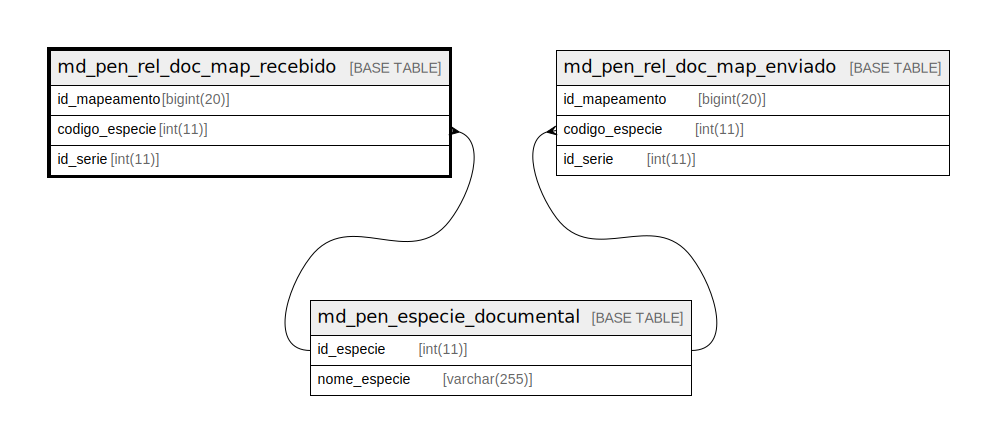

# md_pen_rel_doc_map_recebido

## Description

<details>
<summary><strong>Table Definition</strong></summary>

```sql
CREATE TABLE `md_pen_rel_doc_map_recebido` (
  `id_mapeamento` bigint(20) NOT NULL,
  `codigo_especie` int(11) NOT NULL,
  `id_serie` int(11) NOT NULL,
  PRIMARY KEY (`id_mapeamento`),
  KEY `fk_md_pen_rel_doc_map_rec_seri` (`id_serie`),
  KEY `fk_md_pen_rel_doc_map_rec_espe` (`codigo_especie`),
  CONSTRAINT `fk_md_pen_rel_doc_map_rec_espe` FOREIGN KEY (`codigo_especie`) REFERENCES `md_pen_especie_documental` (`id_especie`),
  CONSTRAINT `fk_md_pen_rel_doc_map_rec_seri` FOREIGN KEY (`id_serie`) REFERENCES `serie` (`id_serie`)
) ENGINE=InnoDB DEFAULT CHARSET=latin1 COLLATE=latin1_swedish_ci
```

</details>

## Columns

| Name | Type | Default | Nullable | Children | Parents | Comment |
| ---- | ---- | ------- | -------- | -------- | ------- | ------- |
| id_mapeamento | bigint(20) |  | false |  |  |  |
| codigo_especie | int(11) |  | false |  | [md_pen_especie_documental](md_pen_especie_documental.md) |  |
| id_serie | int(11) |  | false |  |  |  |

## Constraints

| Name | Type | Definition |
| ---- | ---- | ---------- |
| fk_md_pen_rel_doc_map_rec_espe | FOREIGN KEY | FOREIGN KEY (codigo_especie) REFERENCES md_pen_especie_documental (id_especie) |
| fk_md_pen_rel_doc_map_rec_seri | FOREIGN KEY | FOREIGN KEY (id_serie) REFERENCES serie (id_serie) |
| PRIMARY | PRIMARY KEY | PRIMARY KEY (id_mapeamento) |

## Indexes

| Name | Definition |
| ---- | ---------- |
| fk_md_pen_rel_doc_map_rec_espe | KEY fk_md_pen_rel_doc_map_rec_espe (codigo_especie) USING BTREE |
| fk_md_pen_rel_doc_map_rec_seri | KEY fk_md_pen_rel_doc_map_rec_seri (id_serie) USING BTREE |
| PRIMARY | PRIMARY KEY (id_mapeamento) USING BTREE |

## Relations



---

> Generated by [tbls](https://github.com/k1LoW/tbls)
