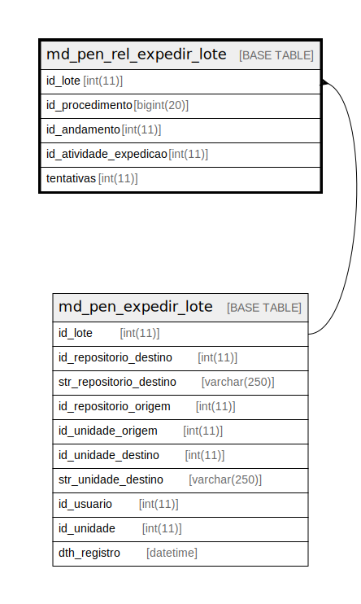

# md_pen_rel_expedir_lote

## Description

<details>
<summary><strong>Table Definition</strong></summary>

```sql
CREATE TABLE `md_pen_rel_expedir_lote` (
  `id_lote` int(11) NOT NULL,
  `id_procedimento` bigint(20) NOT NULL,
  `id_andamento` int(11) NOT NULL,
  `id_atividade_expedicao` int(11) NOT NULL,
  `tentativas` int(11) DEFAULT NULL,
  PRIMARY KEY (`id_procedimento`,`id_lote`),
  KEY `i01_md_pen_rel_expedir_lote` (`id_procedimento`),
  KEY `i02_md_pen_rel_expedir_lote` (`id_lote`),
  CONSTRAINT `fk_md_pen_rel_expedir_lote` FOREIGN KEY (`id_lote`) REFERENCES `md_pen_expedir_lote` (`id_lote`)
) ENGINE=InnoDB DEFAULT CHARSET=latin1 COLLATE=latin1_swedish_ci
```

</details>

## Columns

| Name | Type | Default | Nullable | Children | Parents | Comment |
| ---- | ---- | ------- | -------- | -------- | ------- | ------- |
| id_lote | int(11) |  | false |  | [md_pen_expedir_lote](md_pen_expedir_lote.md) |  |
| id_procedimento | bigint(20) |  | false |  |  |  |
| id_andamento | int(11) |  | false |  |  |  |
| id_atividade_expedicao | int(11) |  | false |  |  |  |
| tentativas | int(11) | NULL | true |  |  |  |

## Constraints

| Name | Type | Definition |
| ---- | ---- | ---------- |
| fk_md_pen_rel_expedir_lote | FOREIGN KEY | FOREIGN KEY (id_lote) REFERENCES md_pen_expedir_lote (id_lote) |
| PRIMARY | PRIMARY KEY | PRIMARY KEY (id_procedimento, id_lote) |

## Indexes

| Name | Definition |
| ---- | ---------- |
| i01_md_pen_rel_expedir_lote | KEY i01_md_pen_rel_expedir_lote (id_procedimento) USING BTREE |
| i02_md_pen_rel_expedir_lote | KEY i02_md_pen_rel_expedir_lote (id_lote) USING BTREE |
| PRIMARY | PRIMARY KEY (id_procedimento, id_lote) USING BTREE |

## Relations



---

> Generated by [tbls](https://github.com/k1LoW/tbls)
