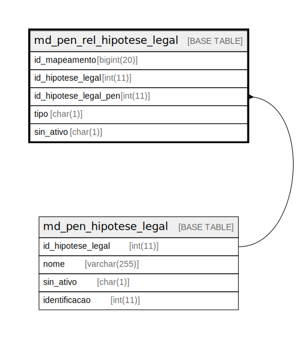

# md_pen_rel_hipotese_legal

## Description

<details>
<summary><strong>Table Definition</strong></summary>

```sql
CREATE TABLE `md_pen_rel_hipotese_legal` (
  `id_mapeamento` bigint(20) NOT NULL,
  `id_hipotese_legal` int(11) NOT NULL,
  `id_hipotese_legal_pen` int(11) DEFAULT NULL,
  `tipo` char(1) NOT NULL DEFAULT 'E',
  `sin_ativo` char(1) NOT NULL DEFAULT 'S',
  PRIMARY KEY (`id_mapeamento`),
  UNIQUE KEY `ak1_rel_hipotese_legal` (`id_hipotese_legal`,`id_hipotese_legal_pen`,`tipo`),
  KEY `fk_md_pen_rel_hipotese_pen` (`id_hipotese_legal_pen`),
  CONSTRAINT `fk_md_pen_rel_hipotese_legal` FOREIGN KEY (`id_hipotese_legal`) REFERENCES `hipotese_legal` (`id_hipotese_legal`),
  CONSTRAINT `fk_md_pen_rel_hipotese_pen` FOREIGN KEY (`id_hipotese_legal_pen`) REFERENCES `md_pen_hipotese_legal` (`id_hipotese_legal`)
) ENGINE=InnoDB DEFAULT CHARSET=latin1 COLLATE=latin1_swedish_ci
```

</details>

## Columns

| Name | Type | Default | Nullable | Children | Parents | Comment |
| ---- | ---- | ------- | -------- | -------- | ------- | ------- |
| id_mapeamento | bigint(20) |  | false |  |  |  |
| id_hipotese_legal | int(11) |  | false |  |  |  |
| id_hipotese_legal_pen | int(11) | NULL | true |  | [md_pen_hipotese_legal](md_pen_hipotese_legal.md) |  |
| tipo | char(1) | 'E' | false |  |  |  |
| sin_ativo | char(1) | 'S' | false |  |  |  |

## Constraints

| Name | Type | Definition |
| ---- | ---- | ---------- |
| ak1_rel_hipotese_legal | UNIQUE | UNIQUE KEY ak1_rel_hipotese_legal (id_hipotese_legal, id_hipotese_legal_pen, tipo) |
| fk_md_pen_rel_hipotese_legal | FOREIGN KEY | FOREIGN KEY (id_hipotese_legal) REFERENCES hipotese_legal (id_hipotese_legal) |
| fk_md_pen_rel_hipotese_pen | FOREIGN KEY | FOREIGN KEY (id_hipotese_legal_pen) REFERENCES md_pen_hipotese_legal (id_hipotese_legal) |
| PRIMARY | PRIMARY KEY | PRIMARY KEY (id_mapeamento) |

## Indexes

| Name | Definition |
| ---- | ---------- |
| fk_md_pen_rel_hipotese_pen | KEY fk_md_pen_rel_hipotese_pen (id_hipotese_legal_pen) USING BTREE |
| PRIMARY | PRIMARY KEY (id_mapeamento) USING BTREE |
| ak1_rel_hipotese_legal | UNIQUE KEY ak1_rel_hipotese_legal (id_hipotese_legal, id_hipotese_legal_pen, tipo) USING BTREE |

## Relations



---

> Generated by [tbls](https://github.com/k1LoW/tbls)
