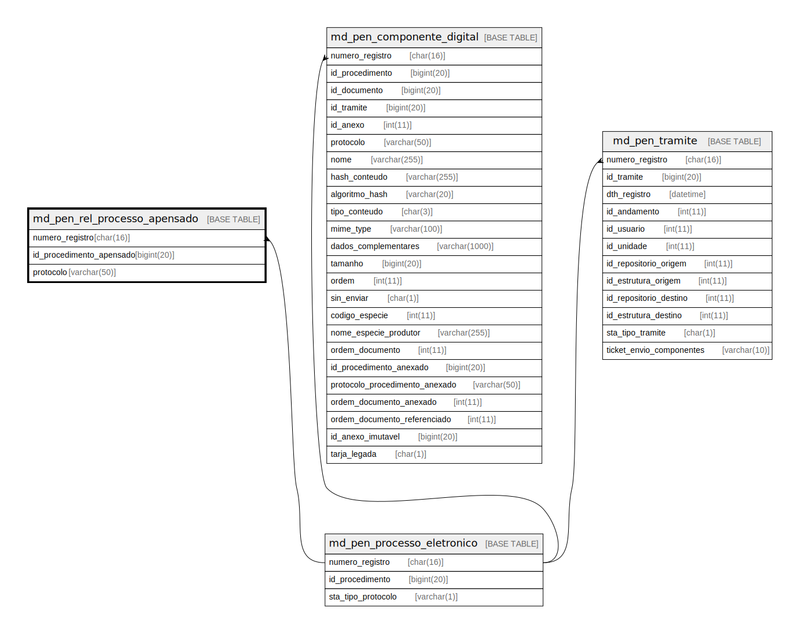

# md_pen_rel_processo_apensado

## Description

<details>
<summary><strong>Table Definition</strong></summary>

```sql
CREATE TABLE `md_pen_rel_processo_apensado` (
  `numero_registro` char(16) NOT NULL,
  `id_procedimento_apensado` bigint(20) NOT NULL,
  `protocolo` varchar(50) NOT NULL,
  PRIMARY KEY (`numero_registro`,`id_procedimento_apensado`),
  KEY `i01_md_pen_rel_processo_apensa` (`numero_registro`),
  KEY `i02_md_pen_rel_processo_apensa` (`id_procedimento_apensado`),
  CONSTRAINT `fk_md_pen_proc_eletr_apensado` FOREIGN KEY (`numero_registro`) REFERENCES `md_pen_processo_eletronico` (`numero_registro`)
) ENGINE=InnoDB DEFAULT CHARSET=latin1 COLLATE=latin1_swedish_ci
```

</details>

## Columns

| Name | Type | Default | Nullable | Children | Parents | Comment |
| ---- | ---- | ------- | -------- | -------- | ------- | ------- |
| numero_registro | char(16) |  | false |  | [md_pen_processo_eletronico](md_pen_processo_eletronico.md) |  |
| id_procedimento_apensado | bigint(20) |  | false |  |  |  |
| protocolo | varchar(50) |  | false |  |  |  |

## Constraints

| Name | Type | Definition |
| ---- | ---- | ---------- |
| fk_md_pen_proc_eletr_apensado | FOREIGN KEY | FOREIGN KEY (numero_registro) REFERENCES md_pen_processo_eletronico (numero_registro) |
| PRIMARY | PRIMARY KEY | PRIMARY KEY (numero_registro, id_procedimento_apensado) |

## Indexes

| Name | Definition |
| ---- | ---------- |
| i01_md_pen_rel_processo_apensa | KEY i01_md_pen_rel_processo_apensa (numero_registro) USING BTREE |
| i02_md_pen_rel_processo_apensa | KEY i02_md_pen_rel_processo_apensa (id_procedimento_apensado) USING BTREE |
| PRIMARY | PRIMARY KEY (numero_registro, id_procedimento_apensado) USING BTREE |

## Relations



---

> Generated by [tbls](https://github.com/k1LoW/tbls)
