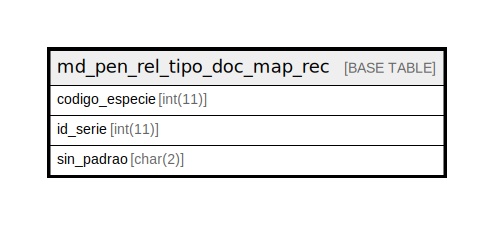

# md_pen_rel_tipo_doc_map_rec

## Description

<details>
<summary><strong>Table Definition</strong></summary>

```sql
CREATE TABLE `md_pen_rel_tipo_doc_map_rec` (
  `codigo_especie` int(11) NOT NULL,
  `id_serie` int(11) NOT NULL,
  `sin_padrao` char(2) NOT NULL,
  PRIMARY KEY (`codigo_especie`,`id_serie`),
  KEY `i01_md_pen_rel_tipo_doc_map_re` (`codigo_especie`),
  KEY `i02_md_pen_rel_tipo_doc_map_re` (`id_serie`),
  CONSTRAINT `fk_md_pen_rel_tipo_doc_serie` FOREIGN KEY (`id_serie`) REFERENCES `serie` (`id_serie`)
) ENGINE=InnoDB DEFAULT CHARSET=latin1 COLLATE=latin1_swedish_ci
```

</details>

## Columns

| Name | Type | Default | Nullable | Children | Parents | Comment |
| ---- | ---- | ------- | -------- | -------- | ------- | ------- |
| codigo_especie | int(11) |  | false |  |  |  |
| id_serie | int(11) |  | false |  |  |  |
| sin_padrao | char(2) |  | false |  |  |  |

## Constraints

| Name | Type | Definition |
| ---- | ---- | ---------- |
| fk_md_pen_rel_tipo_doc_serie | FOREIGN KEY | FOREIGN KEY (id_serie) REFERENCES serie (id_serie) |
| PRIMARY | PRIMARY KEY | PRIMARY KEY (codigo_especie, id_serie) |

## Indexes

| Name | Definition |
| ---- | ---------- |
| i01_md_pen_rel_tipo_doc_map_re | KEY i01_md_pen_rel_tipo_doc_map_re (codigo_especie) USING BTREE |
| i02_md_pen_rel_tipo_doc_map_re | KEY i02_md_pen_rel_tipo_doc_map_re (id_serie) USING BTREE |
| PRIMARY | PRIMARY KEY (codigo_especie, id_serie) USING BTREE |

## Relations



---

> Generated by [tbls](https://github.com/k1LoW/tbls)
