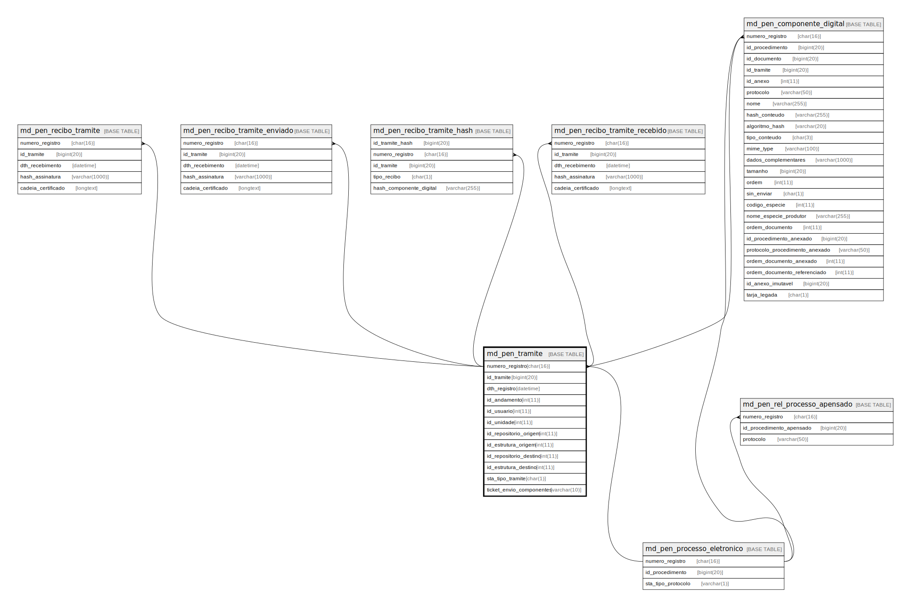

# md_pen_tramite

## Description

<details>
<summary><strong>Table Definition</strong></summary>

```sql
CREATE TABLE `md_pen_tramite` (
  `numero_registro` char(16) NOT NULL,
  `id_tramite` bigint(20) NOT NULL,
  `dth_registro` datetime DEFAULT NULL,
  `id_andamento` int(11) DEFAULT NULL,
  `id_usuario` int(11) DEFAULT NULL,
  `id_unidade` int(11) DEFAULT NULL,
  `id_repositorio_origem` int(11) DEFAULT NULL,
  `id_estrutura_origem` int(11) DEFAULT NULL,
  `id_repositorio_destino` int(11) DEFAULT NULL,
  `id_estrutura_destino` int(11) DEFAULT NULL,
  `sta_tipo_tramite` char(1) DEFAULT NULL,
  `ticket_envio_componentes` varchar(10) DEFAULT NULL,
  PRIMARY KEY (`id_tramite`),
  UNIQUE KEY `UK_md_pen_tramite` (`numero_registro`,`id_tramite`),
  KEY `fk_md_pen_tramite_usuario` (`id_usuario`),
  KEY `fk_md_pen_tramite_unidade` (`id_unidade`),
  CONSTRAINT `fk_md_pen_tramite_proc_eletr` FOREIGN KEY (`numero_registro`) REFERENCES `md_pen_processo_eletronico` (`numero_registro`),
  CONSTRAINT `fk_md_pen_tramite_unidade` FOREIGN KEY (`id_unidade`) REFERENCES `unidade` (`id_unidade`),
  CONSTRAINT `fk_md_pen_tramite_usuario` FOREIGN KEY (`id_usuario`) REFERENCES `usuario` (`id_usuario`)
) ENGINE=InnoDB DEFAULT CHARSET=latin1 COLLATE=latin1_swedish_ci
```

</details>

## Columns

| Name | Type | Default | Nullable | Children | Parents | Comment |
| ---- | ---- | ------- | -------- | -------- | ------- | ------- |
| numero_registro | char(16) |  | false | [md_pen_componente_digital](md_pen_componente_digital.md) [md_pen_recibo_tramite](md_pen_recibo_tramite.md) [md_pen_recibo_tramite_enviado](md_pen_recibo_tramite_enviado.md) [md_pen_recibo_tramite_hash](md_pen_recibo_tramite_hash.md) [md_pen_recibo_tramite_recebido](md_pen_recibo_tramite_recebido.md) | [md_pen_processo_eletronico](md_pen_processo_eletronico.md) |  |
| id_tramite | bigint(20) |  | false | [md_pen_componente_digital](md_pen_componente_digital.md) [md_pen_recibo_tramite](md_pen_recibo_tramite.md) [md_pen_recibo_tramite_enviado](md_pen_recibo_tramite_enviado.md) [md_pen_recibo_tramite_hash](md_pen_recibo_tramite_hash.md) [md_pen_recibo_tramite_recebido](md_pen_recibo_tramite_recebido.md) |  |  |
| dth_registro | datetime | NULL | true |  |  |  |
| id_andamento | int(11) | NULL | true |  |  |  |
| id_usuario | int(11) | NULL | true |  |  |  |
| id_unidade | int(11) | NULL | true |  |  |  |
| id_repositorio_origem | int(11) | NULL | true |  |  |  |
| id_estrutura_origem | int(11) | NULL | true |  |  |  |
| id_repositorio_destino | int(11) | NULL | true |  |  |  |
| id_estrutura_destino | int(11) | NULL | true |  |  |  |
| sta_tipo_tramite | char(1) | NULL | true |  |  |  |
| ticket_envio_componentes | varchar(10) | NULL | true |  |  |  |

## Constraints

| Name | Type | Definition |
| ---- | ---- | ---------- |
| fk_md_pen_tramite_proc_eletr | FOREIGN KEY | FOREIGN KEY (numero_registro) REFERENCES md_pen_processo_eletronico (numero_registro) |
| fk_md_pen_tramite_unidade | FOREIGN KEY | FOREIGN KEY (id_unidade) REFERENCES unidade (id_unidade) |
| fk_md_pen_tramite_usuario | FOREIGN KEY | FOREIGN KEY (id_usuario) REFERENCES usuario (id_usuario) |
| PRIMARY | PRIMARY KEY | PRIMARY KEY (id_tramite) |
| UK_md_pen_tramite | UNIQUE | UNIQUE KEY UK_md_pen_tramite (numero_registro, id_tramite) |

## Indexes

| Name | Definition |
| ---- | ---------- |
| fk_md_pen_tramite_unidade | KEY fk_md_pen_tramite_unidade (id_unidade) USING BTREE |
| fk_md_pen_tramite_usuario | KEY fk_md_pen_tramite_usuario (id_usuario) USING BTREE |
| PRIMARY | PRIMARY KEY (id_tramite) USING BTREE |
| UK_md_pen_tramite | UNIQUE KEY UK_md_pen_tramite (numero_registro, id_tramite) USING BTREE |

## Relations



---

> Generated by [tbls](https://github.com/k1LoW/tbls)
