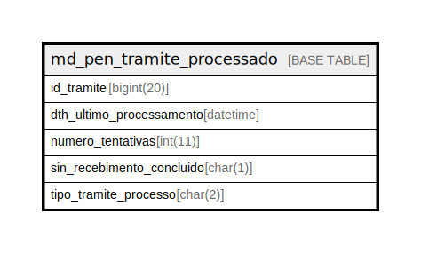

# md_pen_tramite_processado

## Description

<details>
<summary><strong>Table Definition</strong></summary>

```sql
CREATE TABLE `md_pen_tramite_processado` (
  `id_tramite` bigint(20) NOT NULL,
  `dth_ultimo_processamento` datetime NOT NULL,
  `numero_tentativas` int(11) NOT NULL,
  `sin_recebimento_concluido` char(1) NOT NULL,
  `tipo_tramite_processo` char(2) NOT NULL DEFAULT 'RP',
  PRIMARY KEY (`id_tramite`,`tipo_tramite_processo`)
) ENGINE=InnoDB DEFAULT CHARSET=latin1 COLLATE=latin1_swedish_ci
```

</details>

## Columns

| Name | Type | Default | Nullable | Children | Parents | Comment |
| ---- | ---- | ------- | -------- | -------- | ------- | ------- |
| id_tramite | bigint(20) |  | false |  |  |  |
| dth_ultimo_processamento | datetime |  | false |  |  |  |
| numero_tentativas | int(11) |  | false |  |  |  |
| sin_recebimento_concluido | char(1) |  | false |  |  |  |
| tipo_tramite_processo | char(2) | 'RP' | false |  |  |  |

## Constraints

| Name | Type | Definition |
| ---- | ---- | ---------- |
| PRIMARY | PRIMARY KEY | PRIMARY KEY (id_tramite, tipo_tramite_processo) |

## Indexes

| Name | Definition |
| ---- | ---------- |
| PRIMARY | PRIMARY KEY (id_tramite, tipo_tramite_processo) USING BTREE |

## Relations



---

> Generated by [tbls](https://github.com/k1LoW/tbls)
