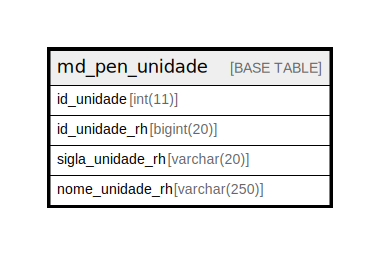

# md_pen_unidade

## Description

<details>
<summary><strong>Table Definition</strong></summary>

```sql
CREATE TABLE `md_pen_unidade` (
  `id_unidade` int(11) NOT NULL,
  `id_unidade_rh` bigint(20) NOT NULL,
  `sigla_unidade_rh` varchar(20) DEFAULT NULL,
  `nome_unidade_rh` varchar(250) DEFAULT NULL,
  PRIMARY KEY (`id_unidade`),
  CONSTRAINT `fk_md_pen_unidade_unidade` FOREIGN KEY (`id_unidade`) REFERENCES `unidade` (`id_unidade`)
) ENGINE=InnoDB DEFAULT CHARSET=latin1 COLLATE=latin1_swedish_ci
```

</details>

## Columns

| Name | Type | Default | Nullable | Children | Parents | Comment |
| ---- | ---- | ------- | -------- | -------- | ------- | ------- |
| id_unidade | int(11) |  | false |  |  |  |
| id_unidade_rh | bigint(20) |  | false |  |  |  |
| sigla_unidade_rh | varchar(20) | NULL | true |  |  |  |
| nome_unidade_rh | varchar(250) | NULL | true |  |  |  |

## Constraints

| Name | Type | Definition |
| ---- | ---- | ---------- |
| fk_md_pen_unidade_unidade | FOREIGN KEY | FOREIGN KEY (id_unidade) REFERENCES unidade (id_unidade) |
| PRIMARY | PRIMARY KEY | PRIMARY KEY (id_unidade) |

## Indexes

| Name | Definition |
| ---- | ---------- |
| PRIMARY | PRIMARY KEY (id_unidade) USING BTREE |

## Relations



---

> Generated by [tbls](https://github.com/k1LoW/tbls)
